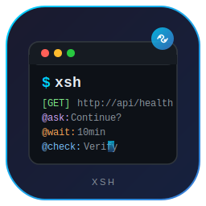

# xsh

<p align="center">
  
</p>

<p align="center">
  <strong>xsh</strong> - 任务执行工具
</p>

<p align="center">
  中文文档 | <a href="README.md">English</a>
</p>

---

xsh 是一个基于 Go 的任务执行工具，可以读取任务文件（txt/md），自动化生成和执行 HTTP、SSH、gRPC 任务。支持 TUI 交互模式、LLM 推理任务分析及结构化命令系统。

## 功能特性

- **任务文件解析** - 读取 `.txt`/`.md` 文件，解析结构化任务命令
- **命令语法** - `@{命令}:{意图描述}` 形式的命令解析
  - `@ask:` - 交互式用户确认
  - `@wait:` - 计时等待
  - `@check:` - 打印任务结果并询问是否继续
- **HTTP 任务执行** - `[GET]`/`[POST]`/`[PUT]`/`[DELETE]` URL 格式
- **TUI 交互模式** - 终端界面展示任务列表、执行进度和确认对话框
- **LLM 集成** - 本地 ONNX GenAI 模型推理，用于任务分析和规划
  - 基于 `onnxruntime-genai` 实现真实推理（分词、自回归生成、KV 缓存、采样）
  - 支持流式输出（`-stream` 参数）
  - 无模型时自动降级为 Mock 推理
- **模型管理** - `model search`、`model list`、`model select` CLI 命令
- **CLI 模式** - `-i` 指定输入任务文件，`-o` 输出执行结果

## 安装

```bash
go build -o xsh ./cmd/xsh
```

## 使用方式

### TUI 交互模式

```bash
./xsh
```

### CLI 模式

```bash
# 从文件执行任务
./xsh -i tasks.txt

# 执行任务并保存结果
./xsh -i tasks.txt -o results.txt

# 使用 LLM 模型分析任务
./xsh -m models/deepseek-r1-distill -i migration.txt

# LLM 推理流式输出
./xsh -m models/deepseek-r1-distill -p "解释这个迁移方案" -stream
```

### 模型管理

```bash
# 在 HuggingFace 搜索模型
./xsh model search onnx

# 列出本地模型
./xsh model list

# 选择模型
./xsh model select deepseek-r1-distill
```

### 测试模式

```bash
# 运行 ONNX GenAI 测试（Mock 推理，无需下载模型）
./xsh -test

# 运行测试并启用流式输出
./xsh -test -stream
```

### LLM 推理前置条件

使用真实 LLM 推理需要：

1. **GenAI 动态库** - 首次使用时自动下载到 `lib/` 目录：
   - `onnxruntime-genai.dll` (Windows) / `.so` (Linux) / `.dylib` (macOS)
   - `onnxruntime.dll` (Windows) / `.so` (Linux) / `.dylib` (macOS)

2. **ONNX 模型目录** - 从 HuggingFace 下载，例如：
   ```
   models/deepseek-r1-distill-qwen-1.5B/
   ├── genai_config.json
   ├── model.onnx
   ├── model.onnx.data
   ├── tokenizer.json
   └── tokenizer_config.json
   ```

## 任务文件格式

```text
# 这是注释
> 这也是注释

# HTTP 请求
[GET] http://example.com/api/health
[POST] http://example.com/api/deploy

# 交互命令
@ask: 确认是否继续执行部署？
@wait: 10min
@check: 验证部署状态
```

## 项目结构

```
xsh/
├── cmd/xsh/           # 入口和 CLI
├── internal/
│   ├── executor/      # 任务执行引擎
│   ├── parser/        # 任务文件解析器
│   ├── tui/           # 终端 UI
│   └── types/         # 类型定义
├── pkg/llm/           # LLM 集成包
│   ├── analyzer.go    # 任务分析器
│   ├── cli.go         # 模型 CLI 命令
│   ├── download.go    # HuggingFace 模型下载
│   └── model.go       # ONNX 模型加载与推理
├── tests/data/        # 测试数据文件
└── plans/             # 需求文档
```

## 运行测试

```bash
go test ./... -v
```

## 许可证

MIT
